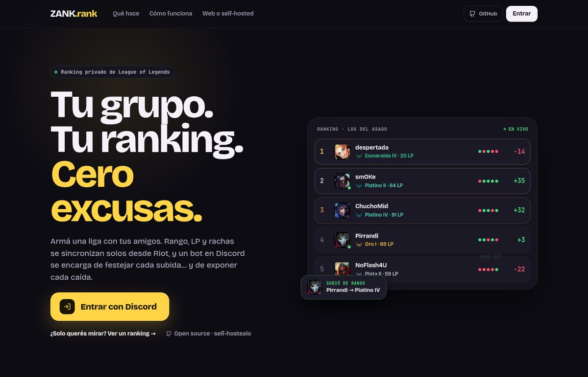
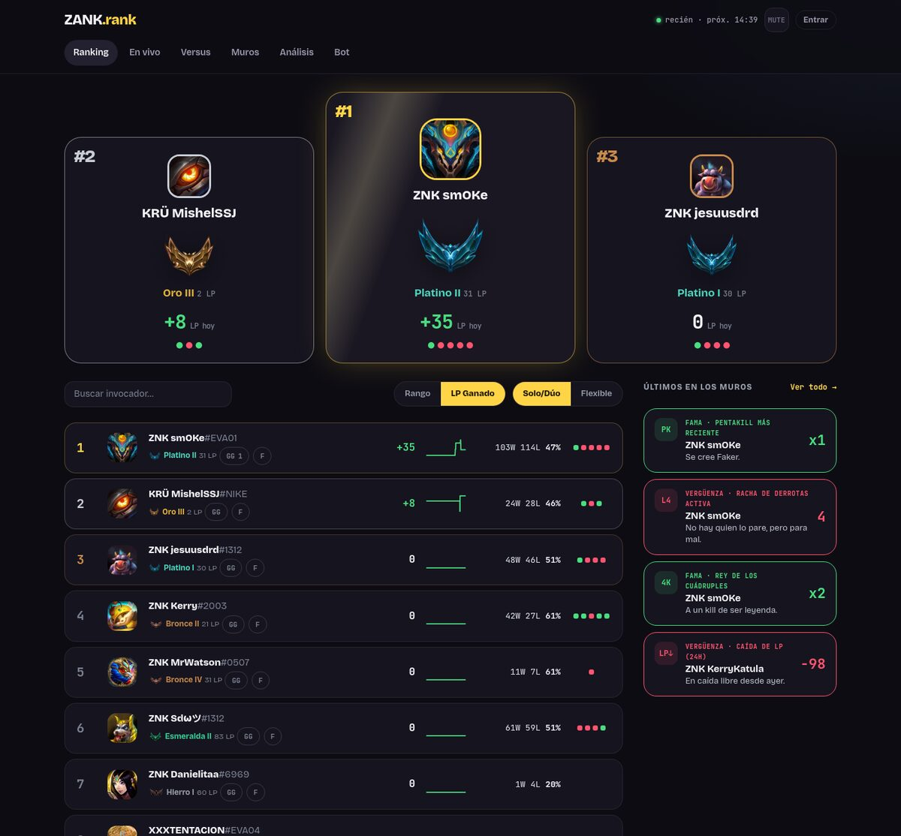
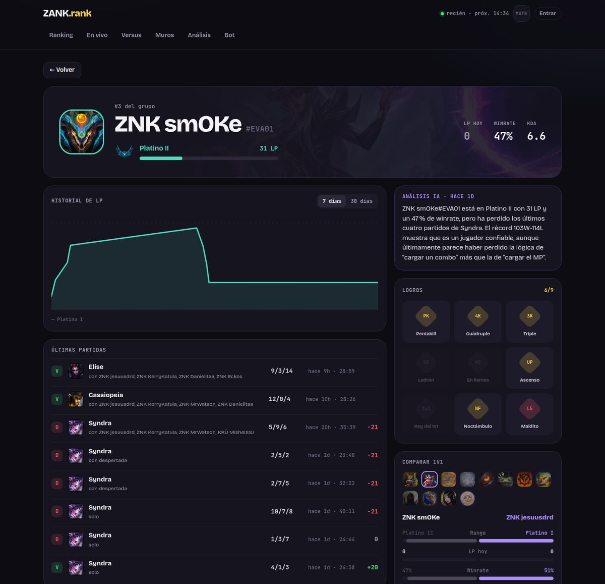
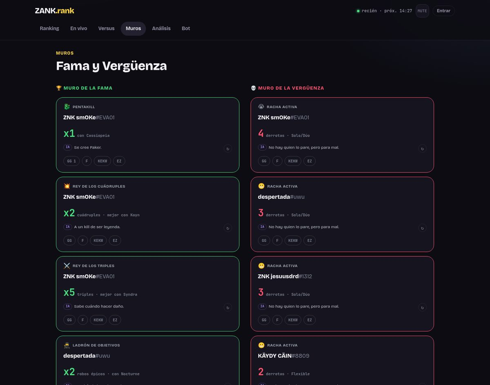
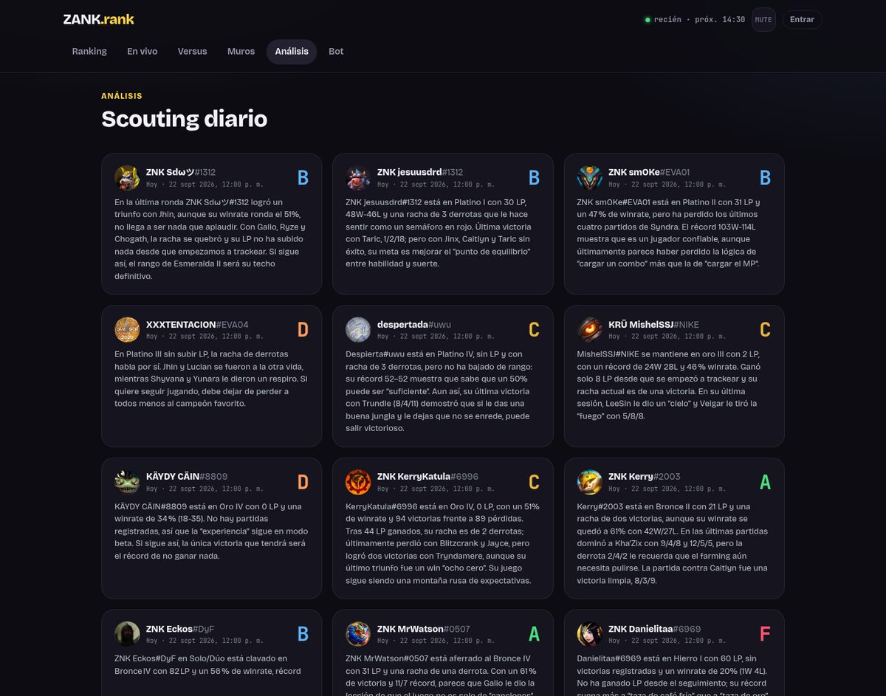

🌐 **Español** · [English](README.md)

<div align="center">


**Tu grupo. Tu ranking.**

Un ranking de League of Legends para tu grupo de amigos: rango, LP y rachas sincronizados automáticamente desde Riot,
un bot de Discord que festeja cada subida (y expone cada caída) y un montón de cosas para pelearse mejor.

[**Pruébalo en zank.lol**](https://zank.lol) · [Self-hosted con Docker](#-self-hosted-con-docker) · [Qué hace](#-qué-hace)




</div>

---

## 📸 Capturas

<table>
  <tr>
    <td width="50%"><br /><sub><b>Ranking</b>: podio, LP ganado, rachas y reacciones.</sub></td>
    <td width="50%"><br /><sub><b>Perfil</b>: historial de LP, partidas, logros y comparación 1v1.</sub></td>
  </tr>
  <tr>
    <td width="50%"><br /><sub><b>Muros</b>: fama y vergüenza, con comentarios de IA.</sub></td>
    <td width="50%"><br /><sub><b>Análisis</b>: una nota diaria por jugador generada por IA.</sub></td>
  </tr>
</table>

## ✨ Qué hace

| | |
|---|---|
| 🏆 **Ranking en vivo** | Ordenable por rango o por LP ganado, con podio top 3, búsqueda y Solo/Dúo vs Flexible. |
| 📈 **Perfil por jugador** | Gráfico de LP (7 y 30 días), últimas partidas con quién jugó, logros y comparación 1v1 contra cualquiera del grupo. |
| 🟢 **En vivo + apuestas** | Quién está jugando ahora, con timer. Apuesta ZankCoins desde la web o desde Discord a si gana o pierde: paga x2. |
| ⚔️ **Versus** | Detecta cuando dos o más del grupo caen en equipos rivales en una personalizada y lleva la tabla de "reyes del versus". |
| 🧱 **Muros** | Fama (pentakills, cuádruples, robos de objetivos) y vergüenza (rachas de derrotas, caídas de LP), con reacciones. |
| 🤖 **Bot de Discord + IA** | Avisa subidas y bajadas de rango con una tarjeta y un roast generado por IA. `/rank` para consultar y `/agregar-jugador` para sumar cuentas. |
| 🧠 **Análisis diario** | Todos los días, un análisis con IA de cada jugador. |


## 🐳 Self-hosted con Docker

> **Nuevo:** el setup con Docker es reciente. Si algo falla, [abre un issue](https://github.com/pirrandi/zank.rank/issues).

Levanta la edición self-hosted completa: la web, el sync periódico con Riot y el análisis diario,
con la base SQLite guardada en el volumen `zank-data`.

**Necesitas:** Docker con Compose v2 y una [API key de Riot](https://developer.riotgames.com/).

**1. Clona el repositorio**

```bash
git clone https://github.com/pirrandi/zank.rank.git && cd zank.rank
```

**2. Crea el `.env`** y complétalo. Como mínimo, `RIOT_API_KEY` y `SESSION_SECRET` (por ejemplo `openssl rand -hex 32`):

```bash
cp .env.example .env
```

**3. Genera la contraseña del panel admin** y pega la línea `ADMIN_PASSWORD_HASH="..."` en el `.env`:

```bash
docker compose run --rm --no-deps --entrypoint npm app run hash-admin-password -- 'tu-password'
```

**4. Levanta todo**

```bash
docker compose up -d
```

La web queda en `http://localhost:3000` y el panel en `/admin`. Al arrancar, el servicio `app` crea o actualiza
la base y el ranking raíz. El servicio `scheduler` empieza a sincronizar cuando `app` está listo.
Para ver los logs: `docker compose logs -f`.

<details>
<summary><b>Variables de entorno</b></summary>

| Variable | Default | Para qué |
|---|---|---|
| `RIOT_API_KEY` | — | **Obligatoria.** [developer.riotgames.com](https://developer.riotgames.com/). La development key vence cada 24 h. |
| `SESSION_SECRET` | — | **Obligatoria.** String random largo para firmar la sesión. |
| `ADMIN_PASSWORD_HASH` | — | Hash de la contraseña de `/admin` (paso 3). |
| `GROQ_API_KEY` | — | Roasts y análisis con IA ([console.groq.com](https://console.groq.com/keys)). Sin key no hay textos de IA. |
| `DISCORD_BOT_TOKEN`, `DISCORD_PUBLIC_KEY`, `DISCORD_CHANNEL_ID` | — | Bot de Discord. |
| `DISCORD_RANKUP_CHANNEL_ID` | — | Opcional: canal solo para avisos de rango. |
| `DISCORD_APPLICATION_ID`, `DISCORD_GUILD_ID` | — | Solo para registrar los slash commands. |
| `POLL_INTERVAL_MINUTES` | `5` | Cada cuánto se sincroniza con Riot. |
| `ANALYZE_HOUR` | `12` | Hora (0-23) del análisis diario. |
| `TZ` | `UTC` | Zona horaria, por ejemplo `America/Argentina/Buenos_Aires`. |
| `PORT` | `3000` | Puerto del host donde se publica la web. |

`ZANK_EDITION` y `DATABASE_URL` los fija `docker-compose.yml`, así que lo que diga el `.env` para esas dos no aplica.

</details>

<details>
<summary><b>Cuentas, bot de Discord, actualizar y backup</b></summary>

**Agregar cuentas:** desde `/admin`, o con

```bash
docker compose exec app npm run add-account -- <nombre> <tag>
```

**Bot de Discord:**

1. Crea una aplicación en el [Developer Portal](https://discord.com/developers/applications), agrégale un bot y copia el token.
2. En OAuth2 → URL Generator marca `bot` y `applications.commands`, con permisos para leer y enviar mensajes, e invítalo a tu servidor.
3. Copia el `verify_key` de General Information en `DISCORD_PUBLIC_KEY`.
4. Registra `/rank` y `/agregar-jugador`:
   ```bash
   docker compose exec app npm run register-discord-command
   ```
5. En el Developer Portal, configura la **Interactions Endpoint URL** en `https://tu-dominio/api/discord/interactions`.
   Discord exige HTTPS, así que hace falta un reverse proxy con certificado delante (hay un ejemplo de nginx en `deploy/`).

Los canales de avisos también se eligen desde `/admin/settings`, y lo que se guarde ahí tiene prioridad sobre el `.env`.

**Actualizar:**

```bash
git pull && docker compose up -d --build
```

**Backup:** en cada arranque queda una copia en `/data/zank.db.bak`. Para un backup completo del volumen:

```bash
docker compose stop
docker run --rm -v <volumen>:/data -v "$PWD":/backup busybox tar czf /backup/zank-data.tgz -C /data .
docker compose start
```

Reemplaza `<volumen>` por el nombre real (termina en `_zank-data`); puedes verlo con `docker volume ls`.

</details>

<details>
<summary><b>Sin Docker (Node + cron)</b></summary>

```bash
npm install
npx prisma db push                               # crea la base SQLite
npm run migrate-rankings                         # crea el ranking raíz
npm run add-account -- <nombre> <tag>            # ej: npm run add-account -- Faker KR1
npm run build && npm start -- -p 3000
```

Sync y análisis con cron:

```
*/5 * * * *  cd /ruta/al/proyecto && env $(cat .env | xargs) npx tsx scripts/poll.ts >> poll.log 2>&1
0 12 * * *   cd /ruta/al/proyecto && env $(cat .env | xargs) npx tsx scripts/analyze.ts >> analyze.log 2>&1
```

</details>

## 🛠️ Adaptarlo a tu grupo

Está configurado para un grupo que juega en LAS. Para otra región o servidor:

- **Región:** el platform `la2` es el valor por defecto en `scripts/add-account.ts`, en el formulario de `src/app/[slug]/admin/accounts/` y en `/agregar-jugador` (`src/app/api/discord/interactions/route.ts`). Cámbialo por tu [routing value](https://developer.riotgames.com/docs/lol#routing-values) (`na1`, `euw1`, etc.) y ajusta el routing continental en `src/lib/riot.ts`.
- **Rol admin de Discord:** `ADMIN_ROLE_ID` en `src/app/api/discord/interactions/route.ts`.
- **Dominio:** `metadataBase` en `src/app/layout.tsx`.

## 🧱 Stack

Next.js 15 (App Router) · React 19 · TypeScript · Prisma + SQLite · Discord Interactions · Groq.
Las únicas dependencias externas son las APIs de [Riot](https://developer.riotgames.com/), [Discord](https://discord.com/developers/applications) y [Groq](https://console.groq.com/keys).

---

<sub>zank.rank no está afiliado ni respaldado por Riot Games. League of Legends es marca registrada de Riot Games, Inc.</sub>
